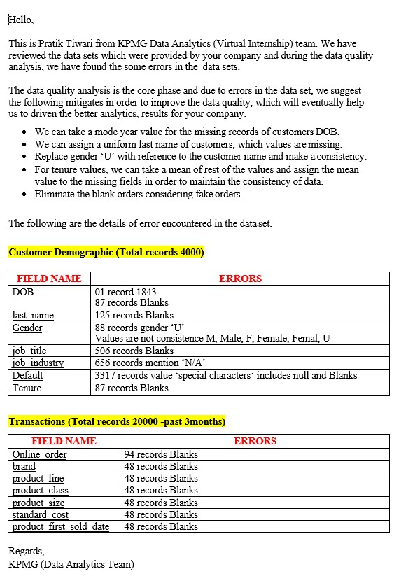
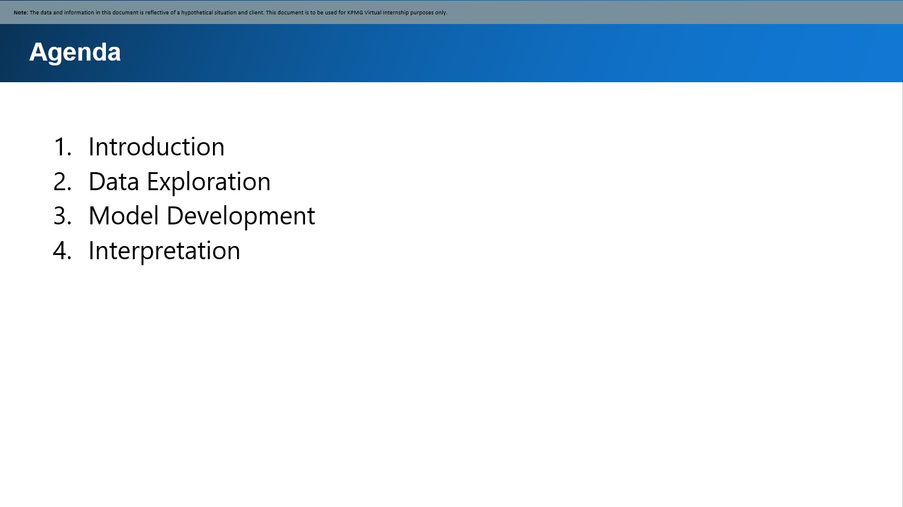
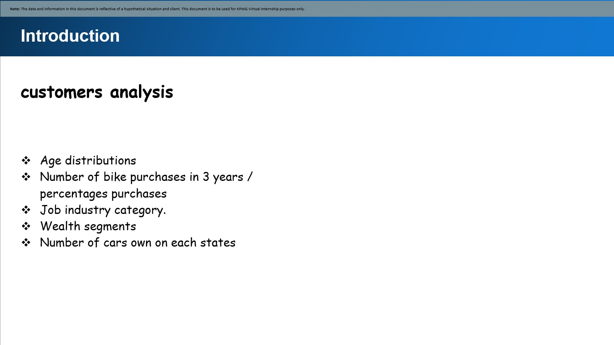
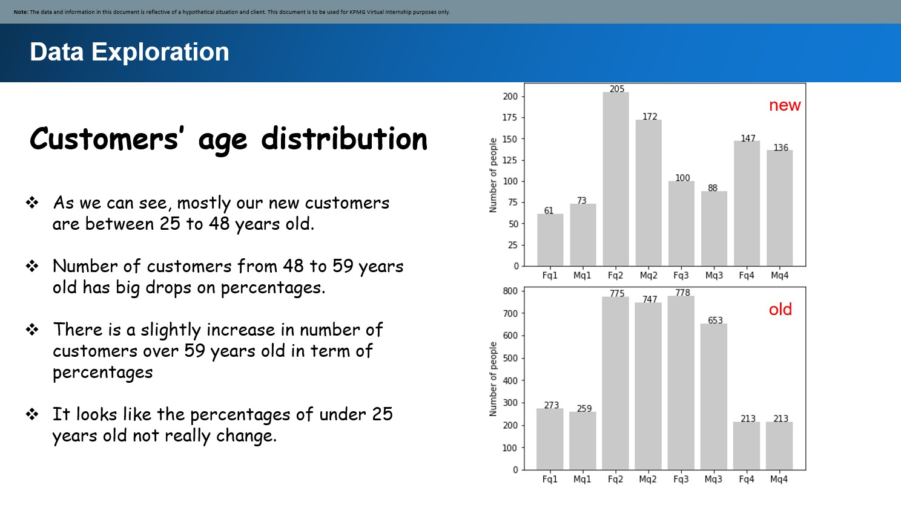
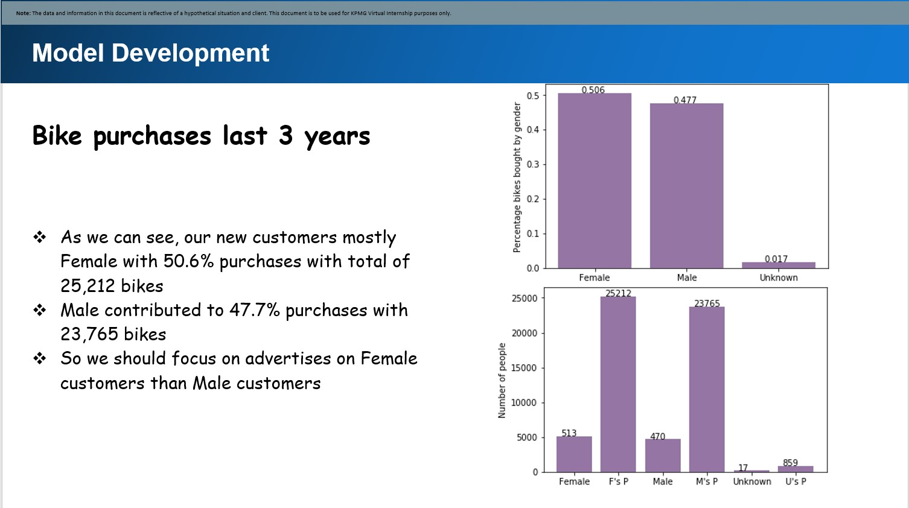
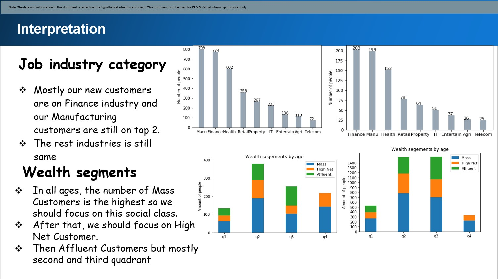
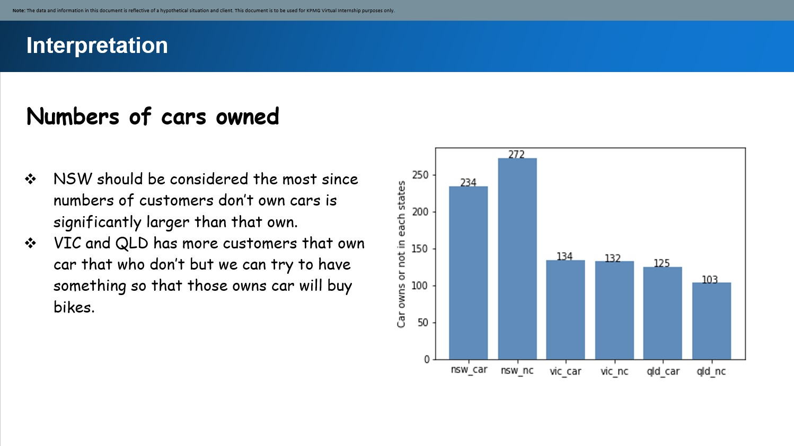

# KPMG_analytical_task
So to give you a little background about this repositry this contains the analytical asignments provided by the KPMG group for their 
virtual intership.

## MODULE 1 TASK:
ssess the quality of their data; as well as make recommendations on ways to clean the underlying data and mitigate these issues.
Also create a report and submit 

## MODULE 2:
pare a detailed approach for completing the analysis including activities – i.e. understanding the data distributions, feature engineering, data transformations, modelling, results interpretation and reporting. This detailed plan needs to be presented to the client to get a sign-off. 
also advise what steps to take.
Create a power point and report it.

## MODULE 3 :
To create a responsive dashborad for the stakeholders 
Display data and summary

